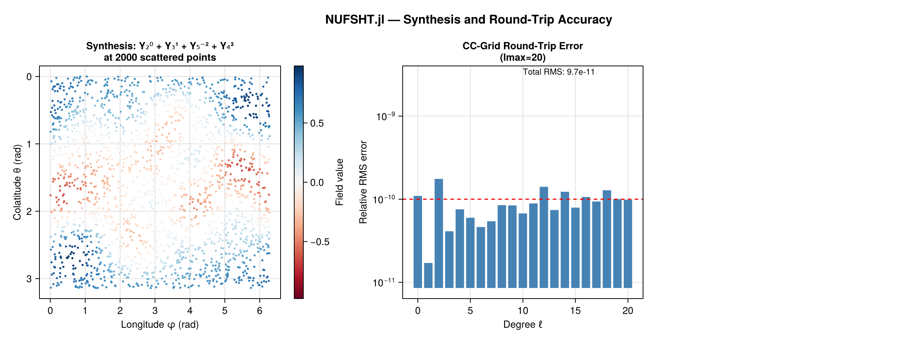
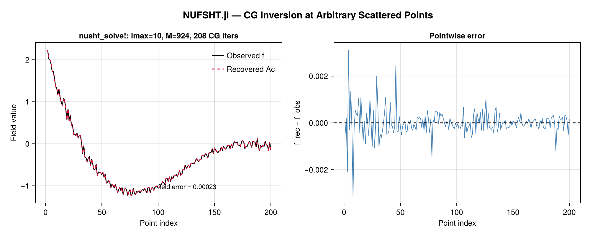
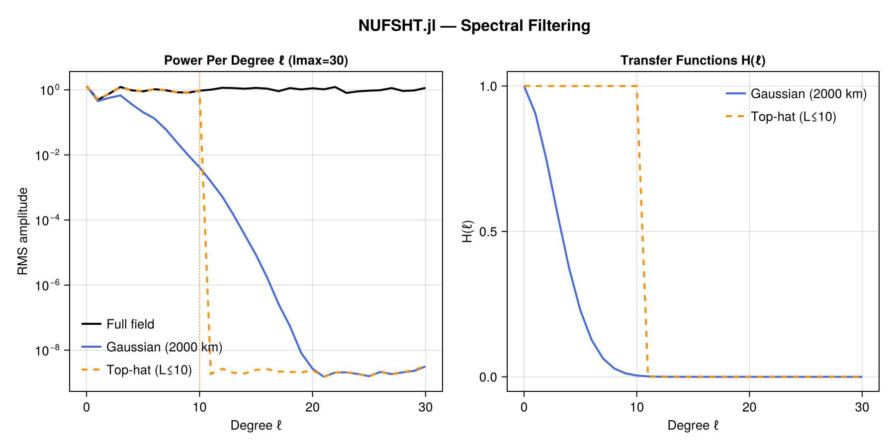
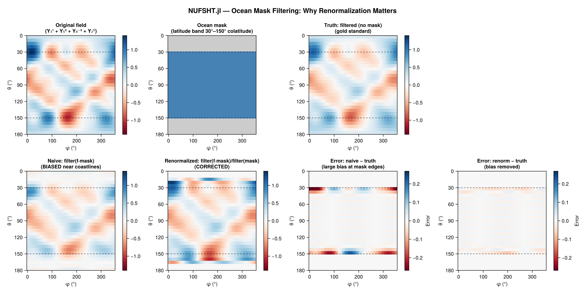

# NUFSHT.jl

**Non-Uniform Fast Spherical Harmonic Transforms** — native Julia implementation of the
Double Fourier Sphere (DFS) + NUFFT algorithm for computing spherical harmonic transforms
at arbitrary scattered (colatitude, longitude) points on the sphere.

## Results

### Synthesis at Scattered Points + Round-Trip Accuracy



### CG Inversion at Arbitrary Scattered Points



### Spectral Filtering (Gaussian and Sharp Cutoff)



### Ocean Mask + Renormalization



## Installation

```julia
using Pkg
Pkg.add(url="https://github.com/jbphyswx/NUFSHT.jl")
```

## Algorithm

The transform decomposes the non-uniform SHT (nuSHT) into four operations
(following Reinecke & Seljebotn 2013 and Belkner et al. 2024):

```
Type 2 (synthesis):   A  = N · F · D · S
Type 1 (adjoint):     A† = S† · D† · F† · N†
```

| Step | Operation | Forward | Adjoint |
|------|-----------|---------|---------|
| **S** | Iso-latitude rSHT: SH coefficients ↔ CC grid | `sph_evaluate!` (PS·P) | `sph_transform!` (S⁻¹, exact on CC) |
| **D** | DFS doubling: extend [0,π] → [0,2π) torus | `dfs_double!` | `dfs_fold!` |
| **F** | 2D FFT with half-pixel CC phase correction | `fft2_to_coeffs` | `ifft2_from_coeffs` |
| **N** | NUFFT: evaluate Fourier series at scattered points | `nufft2d2` | `nufft2d1` |

The DFS doubling extends the sphere to a doubly-periodic torus by reflecting across
the south pole with a φ+π shift. The shift uses `mod1(j + Nφ÷2, Nφ)` to ensure a
proper bijection for all `Nφ` (including odd, which is always the case since
`Nφ = 2*lmax+1`).

### Adjoint vs inverse

- **`nusht_type1!`** computes `A†f` — the adjoint/analysis. On the Clenshaw-Curtis
  (CC) quadrature grid (`sph_points(lmax+1)`), the CC quadrature makes `A†A = I`
  (exact round-trip). At arbitrary scattered non-CC points it is only the adjoint.

- **`nusht_solve!`** uses the true Euclidean adjoint (`PS'·P'` for the S step,
  correct `dfs_fold!` for the D step) to solve `(A†A)c = A†f` via Conjugate
  Gradients. This gives exact inversion at any set of scattered points.

> **Use `nusht_type1!` for CC-grid analysis and filtering.**
> **Use `nusht_solve!` for exact inversion at arbitrary scattered points.**

## Accuracy

| Operation | Points | Error | Notes |
|-----------|--------|-------|-------|
| `nusht_type2!` | CC grid (lmax=20) | ~3 × 10⁻¹¹ | vs `sph_evaluate` |
| `nusht_type1!` → `nusht_type2!` | CC grid (lmax=20) | ~7 × 10⁻¹¹ | Round-trip |
| `nusht_solve!` | Scattered, 4× overdetermined (lmax=10) | field ~2.5 × 10⁻⁴ | After ~200 CG iters |

`nusht_solve!` convergence rate depends on the condition number of `A†A`, which
scales with point distribution quality. Jittered-uniform points are well-conditioned;
clustered or gapped distributions require more iterations.

## Usage

### Synthesis at scattered points

```julia
using NUFSHT, FastSphericalHarmonics

lmax = 50
θ = rand(2000) .* π      # colatitudes in [0,π]
φ = rand(2000) .* 2π     # longitudes in [0,2π)
plan = make_plan(θ, φ, lmax; tol=1e-8)

# Set some SH coefficients
C = zeros(lmax+1, 2lmax+1)
C[sph_mode(2, 0)] = 1.0   # Y_2^0
C[sph_mode(3, 1)] = 0.5   # Y_3^1

# Type 2 (synthesis): coefficients → field values at scattered points
f = zeros(length(θ))
nusht_type2!(f, C, plan)
```

### Adjoint analysis (CC grid only — exact round-trip)

```julia
using NUFSHT, FastSphericalHarmonics

lmax = 30
pts = sph_points(lmax + 1)          # Clenshaw-Curtis quadrature grid
θ = vec([θ for θ in pts[1], φ in pts[2]])
φ = vec([φ for θ in pts[1], φ in pts[2]])
plan = make_plan(θ, φ, lmax; tol=1e-10)

C_true = randn(lmax+1, 2lmax+1)
f = zeros(length(θ))
nusht_type2!(f, C_true, plan)     # synthesise

C_rec = similar(plan.C)
nusht_type1!(C_rec, f, plan)      # analyse (exact inverse on CC grid)
# maximum(abs.(C_rec .- C_true)) ≈ 7e-11
```

### Exact inversion at arbitrary scattered points

```julia
using NUFSHT

lmax = 20
M = 4 * (lmax+1)^2    # 4× overdetermined — well-conditioned
θ = ...               # arbitrary scattered colatitudes ∈ (0,π)
φ = ...               # arbitrary scattered longitudes ∈ [0,2π)
plan = make_plan(θ, φ, lmax; tol=1e-10)

f = ...               # observed field values at (θ,φ)

C = similar(plan.C)
C, iters, rel_res = nusht_solve!(C, f, plan; rtol=1e-6, maxiter=500)
# Returns (coefficients, number_of_CG_iterations, final_relative_residual)
```

### Spectral filtering

```julia
using NUFSHT

lmax = 100
plan = make_plan(θ, φ, lmax)

# Gaussian low-pass filter at 500 km scale
filt = gaussian_from_scale(500e3)
f_filtered = similar(f)
nusht_filter!(f_filtered, f, filt, plan)

# Sharp spectral cutoff at degree 50
nusht_filter!(f_filtered, f, TopHatTransfer(50), plan)
```

### Ocean masking and renormalisation

```julia
# Zero out land points, filter, then correct for mask bias
mask = Float64.(is_ocean_point)     # 1.0 = ocean, 0.0 = land
f_masked = f .* mask

f_out = similar(f)
filt = gaussian_from_scale(200e3)
nusht_filter!(f_out, f_masked, filt, plan)
nusht_filter_renorm!(f_out, mask, filt, plan)   # divide by filtered mask
```

## API Reference

| Function | Description |
|----------|-------------|
| `make_plan(θ, φ, lmax; tol, T)` | Construct pre-allocated plan for M scattered points |
| `nusht_type2!(f, C, plan)` | Synthesis: SH coefficients → scattered field values |
| `nusht_type1!(C, f, plan)` | Adjoint analysis (exact inverse on CC grid; adjoint elsewhere) |
| `nusht_solve!(C, f, plan; maxiter, rtol, verbose)` | Exact CG inversion at any scattered points |
| `nusht_filter!(f_out, f_in, filter, plan)` | Spectral filter: type1 → multiply → type2 |
| `nusht_filter_renorm!(f_out, mask, filter, plan)` | Correct land-mask bias after `nusht_filter!` |
| `GaussianTransfer(σ²)` | Gaussian filter `H(ℓ) = exp(-ℓ(ℓ+1)σ²/2)` |
| `gaussian_from_scale(scale_m)` | `GaussianTransfer` from physical scale in metres |
| `TopHatTransfer(L)` | Sharp spectral cutoff at degree `L` |
| `SharpSpectralTransfer(L)` | Alias for `TopHatTransfer` |
| `cutoff_degree(scale_m)` | Convert physical scale (m) to SH degree |

### `nusht_solve!` return value

```julia
C, iters, rel_res = nusht_solve!(C, f, plan; rtol=1e-6, maxiter=500)
```

- `C`: output coefficient array (overwritten in-place)
- `iters`: number of CG iterations performed
- `rel_res`: final relative residual `‖r‖/‖A†f‖`; will be `< rtol` if converged

## Implementation notes

### DFS shift for odd Nφ

`Nφ = 2*lmax+1` is always odd. The φ+π column shift in `dfs_double!` uses
`mod1(j + Nφ÷2, Nφ)` (a proper cyclic permutation). The older conditional
`j <= half ? j+half : j-half` is **not a bijection** for odd Nφ — two input
columns map to the same output column — and was silently wrong, causing `dfs_fold!`
to fail as the algebraic adjoint of `dfs_double!`. The fix uses the inverse shift
`mod1(j - Nφ÷2, Nφ)` in `dfs_fold!`.

### True adjoint vs CC-grid inverse

`nusht_type1!` uses `sph_transform!` (the CC-grid analysis = `S⁻¹`). This gives
an exact round-trip on the CC grid but is NOT the Euclidean matrix adjoint of
`nusht_type2!` at non-CC points. `nusht_solve!` uses the private
`_nusht_true_adjoint!` which applies `PS'·P'` (the true `S†`), making `A†A`
symmetric positive definite and CG convergent for arbitrary point distributions.

## References

- Merilees, P.E. (1973): The pseudospectral approximation applied to the shallow
  water equations on a sphere. *Atmosphere*, 11(1), 13–20.
- Townsend, A. & Olver, S. (2015): The automatic solution of partial differential
  equations using a global spectral method. *J. Comput. Phys.*, 299, 106–123.
- Reinecke, M. & Seljebotn, D.S. (2013): Libsharp – spherical harmonic transforms
  revisited. *A&A*, 554, A112. https://doi.org/10.1051/0004-6361/201220728
- Belkner, S. et al. (2024): cunuSHT – GPU Accelerated Spherical Harmonic Transforms
  on Arbitrary Pixelizations. *arXiv:2406.14542*.
- [FastSphericalHarmonics.jl](https://github.com/eschnett/FastSphericalHarmonics.jl)
- [FINUFFT.jl](https://github.com/ludvigak/FINUFFT.jl)
- [FastTransforms.jl](https://github.com/JuliaApproximation/FastTransforms.jl)
