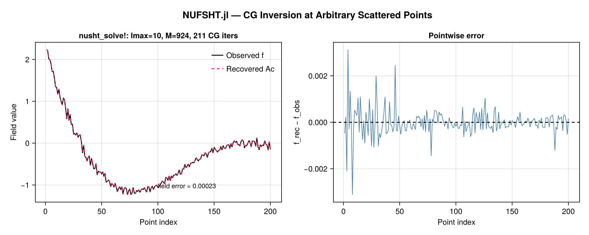
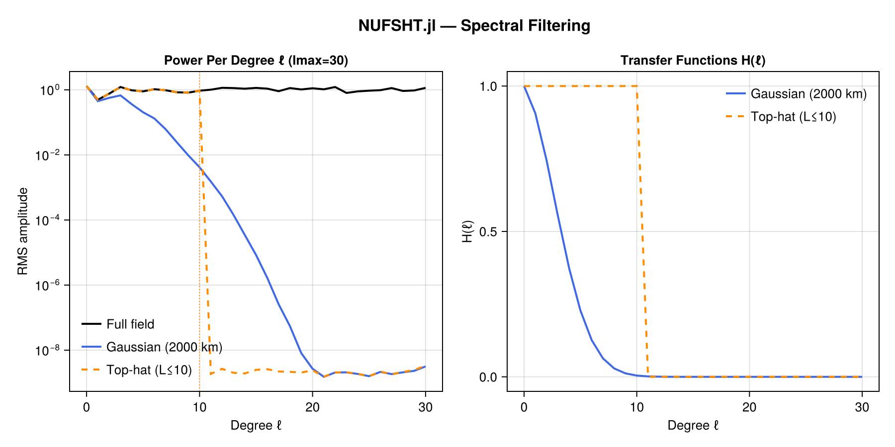
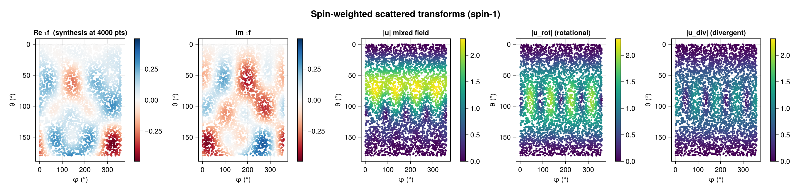

# NUFSHT.jl

[](https://github.com/jbphyswx/NUFSHT.jl/actions/workflows/CI.yml)
[](https://jbphyswx.github.io/NUFSHT.jl/dev/)
[](https://codecov.io/gh/jbphyswx/NUFSHT.jl)

**Non-Uniform Fast Spherical Harmonic Transforms** — native Julia implementation of the
Double Fourier Sphere (DFS) + NUFFT algorithm for computing spherical harmonic transforms
at arbitrary scattered (colatitude, longitude) points on the sphere.

## Results

### Synthesis at Scattered Points + Round-Trip Accuracy


### Inversion at Arbitrary Scattered Points



### Spectral Filtering (Gaussian and Sharp Cutoff)



### Ocean Mask + Renormalization


### Spin-weighted synthesis + spin-1 Hodge decomposition



## Spin-weighted transforms (spin-`s`)

NUFSHT also synthesizes/analyzes **spin-weighted** fields at arbitrary scattered points —
built directly from the Wigner-`d` Fourier factorization plus a 2-D NUFFT, independent of any
spin convention in FastTransforms. Spin-1 is the tangent-vector case (a velocity
`U = u_θ + i u_φ` is a spin-1 field), which enables vector/Helmholtz decomposition on
scattered spherical data.

```julia
using NUFSHT
lmax, s = 32, 1
θ = π .* rand(5000); φ = 2π .* rand(5000)          # scattered colatitude/longitude
plan = make_spin_plan(θ, φ, lmax, s)                # add ntrans=B for batches; ComplexF32 first arg for f32

# synthesis: spin-s coefficients -> complex field values at the points
sf = zeros(ComplexF64, lmax+1, 2lmax+1)             # spin-s coefficients (set some modes)
f  = zeros(ComplexF64, length(θ))
nusht_type2_spin!(f, sf, plan)

# exact inversion at arbitrary scattered points (LSMR on the bidiagonalization of A)
sf_rec = zeros(ComplexF64, lmax+1, 2lmax+1)
nusht_solve_spin!(sf_rec, f, plan; rtol=1e-9)
```

`make_spin_plan` / `nusht_type2_spin!` / `nusht_type1_spin!` (exact adjoint) /
`nusht_solve_spin!`; coefficient indices via `spin_coeff_index(ℓ,m,lmax)`, direct harmonic
values via `sYlm(s,ℓ,m,θ,φ)`. Validated to ~1e-12 (synthesis), ~1e-15 (adjoint), and exact
scattered inversion. See `dev/spin_hodge_validation.jl` for the spin-1 Helmholtz/Hodge use.

## Installation

```julia
using Pkg
Pkg.add(url="https://github.com/jbphyswx/NUFSHT.jl")
```

## Performance, batching, parallelism & GPU

Everything below is dependency-light by default — the accelerators are **package extensions**, loaded
only when you load their trigger package, so a plain `using NUFSHT` never pulls in MPI/CUDA/etc.

- **Persistent guru plans, zero allocation.** A plan builds the FINUFFT guru plans once (points set
  once) and pre-allocates every buffer, so warmed-up `nusht_type2!`/`nusht_type1!` and the hundreds of
  solver matvecs inside `nusht_solve!` allocate **nothing** and never re-plan. (Single-threaded FINUFFT is
  exactly zero-alloc; the all-cores default adds only FINUFFT's own small planner-lock allocation.)
- **Batching (`ntrans = B`).** Transform `B` co-located fields (same points) in one call —
  `make_plan(θ, φ, lmax; ntrans = B)`, coefficients/fields carry a trailing batch axis. FFTW and
  FINUFFT parallelize *across the batch* internally (measured ~4.5× / ~2.8× on small transforms), which
  is the recommended way to use many cores on one node.
- **Real and complex fields.** The field element type is the first (optional) positional argument, as
  it is for `zeros`: `make_plan(Float64, θ, φ, lmax)` for a real field, `make_plan(ComplexF64, …)` for
  a complex one; likewise `make_spin_plan(FE, θ, φ, lmax, s)`. Both compute the same transform — the
  real one additionally exploits the Hermitian symmetry a real field gives its spectrum, folding one
  mode axis in half. The keyword spelling `T = ComplexF64` forwards to the positional form.
- **Mixed precision.** `Float32` and `ComplexF32` are supported. The sphere plans FastTransforms
  provides are `Float64`/`ComplexF64` only, so single-precision plans run their S-step through a
  double-precision slice buffer and everything else at the requested precision.
- **Parallel extensions** (each keyed on its trigger package):
  - `using OhMyThreads` — thread-parallel over independent problems (one plan per task).
  - `using Distributed` — farm independent problems across worker **processes** (`addprocs`); falls
    back to serial when there are none.
  - `using MPI` — point-decomposition: partition the `M` points across ranks; `A` needs no
    communication, `A†` and the point-space norm are `Allreduce`d.
  > Note: FastTransforms is *not* safe to call from a Julia task/thread (its OpenMP corrupts results);
  > the thread/process extensions force it single-threaded, which is why batching + processes are the
  > recommended scaling paths. See `dev/fasttransforms_task_safety.md`.
- **GPU** (`using CUDA`, with `using KernelAbstractions`). The array-indexed steps (the spin Wigner-`d`
  recurrence + bivariate-Fourier assembly, and the per-column solver primitives) are KA `@kernel`s —
  **written once, run on any backend** — and the NUFFT is bound to cuFINUFFT. A device node set yields a
  device-resident plan (buffers `similar` to the nodes). The device kernels are validated bit-for-bit
  against the CPU path on `JLArrays`; end-to-end GPU parity (incl. cuFINUFFT) is in `test/gpu_cuda.jl`,
  to run on NVIDIA hardware.

## Algorithm

The transform writes the spherical harmonic expansion as a Double-Fourier-Sphere
bivariate Fourier series and evaluates that series with a NUFFT:

```
Type 2 (synthesis):   A  = N · F · S
Type 1 (adjoint):     A† = S† · F† · N†
```

| Step | Operation | Forward | Adjoint |
|------|-----------|---------|---------|
| **S** | SH coefficients → DFS bivariate Fourier series | `plan_sph2fourier` (P) | `P'` |
| **F** | cos/sin basis → complex exponential mode array | `_assemble_modes!` | `_assemble_modes_adjoint!` |
| **N** | NUFFT: evaluate the Fourier series at scattered points | guru type-2 plan | guru type-1 plan |

`plan_sph2fourier` already produces the DFS series — that is what it is for — so there is no
equiangular grid in the pipeline and nothing is doubled. For order `m`, the θ basis is
`cos((i-1)θ)` when `|m|` is even and `sin(iθ)` when it is odd, which is the parity the glide
reflection encodes: the DFS extension of `Y_lm` in θ is `sin^|m|θ · Q(cosθ)`.

(The scalar path uses FastTransforms for **S**; the **spin** path replaces it with an on-the-fly
Trapani–Navaza Wigner-`d` recurrence — O(lmax²) memory, numerically stable to lmax ≈ 1024, and also
the device S-engine.)

### Adjoint vs inverse

- **`nusht_type1!`** is `A†` — the exact Euclidean **transpose**, not an inverse. At scattered points
  `A†A ≠ I`; only quadrature on a grid makes the two coincide. For exact analysis of a field already
  sampled on the Clenshaw-Curtis grid, use `FastSphericalHarmonics.sph_transform`.

- **`nusht_solve!`** inverts, by LSMR on the Golub–Kahan bidiagonalization of `A`.

> **Use `nusht_solve!` for inversion at arbitrary scattered points.**

## Accuracy

| Operation | Points | Error | Notes |
|-----------|--------|-------|-------|
| `nusht_type2!` | CC grid (lmax=20) | ~1 × 10⁻¹³ | vs `sph_evaluate` |
| `nusht_type2!` | **Scattered** (lmax=4–20) | ~3 × 10⁻¹³ | vs direct `Σ c_lm Y_lm` |
| `A†` adjoint identity `⟨Ax,y⟩ = ⟨x,A†y⟩` | Scattered | ~1 × 10⁻¹⁵ | |
| `nusht_solve!` | Scattered, 4× overdetermined | coefficients ~1 × 10⁻¹¹ | see below |

Solver convergence depends on `cond(A)`, which is a property of the **point distribution**, not of
`lmax`. Measured on the design matrix over the `l ≤ lmax` modes at fourfold overdetermination:

| Point set | `cond(A)` | Iterations to 10⁻¹⁰ |
|-----------|-----------|---------------------|
| Golden-angle (Fibonacci) lattice | ≈ 1.04 | ≈ 6 |
| i.i.d. area-uniform | 3 – 7 | ≈ 40 |
| Half the points in a small polar cap | 40 – 80 | O(100) |

An index-linked spiral (φ advancing 2π/M per point while θ sweeps pole to pole) winds only once and
is near-degenerate — `cond(A) ≈ 10⁸` at lmax = 10 — so the field is reproduced while the coefficients
are meaningless. Prefer a golden-angle lattice or i.i.d. points.

## Usage

### Synthesis at scattered points

```julia
using NUFSHT, FastSphericalHarmonics

lmax = 50
θ = rand(2000) .* π      # colatitudes in [0,π]
φ = rand(2000) .* 2π     # longitudes in [0,2π)
plan = make_plan(θ, φ, lmax; tol=1e-8)

# Set some SH coefficients
C = zeros(lmax+1, 2lmax+1)
C[sph_mode(2, 0)] = 1.0   # Y_2^0
C[sph_mode(3, 1)] = 0.5   # Y_3^1

# Type 2 (synthesis): coefficients → field values at scattered points
f = zeros(length(θ))
nusht_type2!(f, C, plan)
```

### Adjoint analysis (CC grid only — exact round-trip)

```julia
using NUFSHT, FastSphericalHarmonics

lmax = 30
pts = sph_points(lmax + 1)          # Clenshaw-Curtis quadrature grid
θ = vec([θ for θ in pts[1], φ in pts[2]])
φ = vec([φ for θ in pts[1], φ in pts[2]])
plan = make_plan(θ, φ, lmax; tol=1e-10)

C_true = randn(lmax+1, 2lmax+1)
f = zeros(length(θ))
nusht_type2!(f, C_true, plan)     # synthesise

C_rec = similar(plan.C)
nusht_type1!(C_rec, f, plan)      # analyse (exact inverse on CC grid)
# maximum(abs.(C_rec .- C_true)) ≈ 7e-11
```

### Exact inversion at arbitrary scattered points

```julia
using NUFSHT

lmax = 20
M = 4 * (lmax+1)^2    # 4× overdetermined — well-conditioned
θ = ...               # arbitrary scattered colatitudes ∈ (0,π)
φ = ...               # arbitrary scattered longitudes ∈ [0,2π)
plan = make_plan(θ, φ, lmax; tol=1e-10)

f = ...               # observed field values at (θ,φ)

C = similar(plan.C)
C, iters, rel_res, converged = nusht_solve!(C, f, plan; rtol=1e-6, maxiter=500)
# Returns (coefficients, solver iterations, relative residual of `C`, whether it met `rtol`)
```

### Spectral filtering

```julia
using NUFSHT

lmax = 100
plan = make_plan(θ, φ, lmax)

# Gaussian low-pass filter at 500 km scale
filt = gaussian_from_scale(500e3)
f_filtered = similar(f)
nusht_filter!(f_filtered, f, filt, plan)

# Sharp spectral cutoff at degree 50
nusht_filter!(f_filtered, f, TopHatTransfer(50), plan)
```

### Ocean masking and renormalisation

```julia
# Zero out land points, filter, then correct for mask bias
mask = Float64.(is_ocean_point)     # 1.0 = ocean, 0.0 = land
f_masked = f .* mask

f_out = similar(f)
filt = gaussian_from_scale(200e3)
nusht_filter!(f_out, f_masked, filt, plan)
nusht_filter_renorm!(f_out, mask, filt, plan)   # divide by filtered mask
```

## API Reference

| Function | Description |
|----------|-------------|
| `make_plan([FE,] θ, φ, lmax; tol)` | Construct pre-allocated plan for M scattered points; `FE` real or complex |
| `nusht_type2!(f, C, plan)` | Synthesis: SH coefficients → scattered field values |
| `nusht_type1!(C, f, plan)` | Adjoint analysis (exact inverse on CC grid; adjoint elsewhere) |
| `nusht_solve!(C, f, plan; maxiter, rtol, verbose)` | Exact LSMR inversion at any scattered points |
| `nusht_filter!(f_out, f_in, filter, plan)` | Spectral filter: type1 → multiply → type2 |
| `nusht_filter_renorm!(f_out, mask, filter, plan)` | Correct land-mask bias after `nusht_filter!` |
| `GaussianTransfer(σ²)` | Gaussian filter `H(ℓ) = exp(-ℓ(ℓ+1)σ²/2)` |
| `gaussian_from_scale(scale_m)` | `GaussianTransfer` from physical scale in metres |
| `TopHatTransfer(L)` | Sharp spectral cutoff at degree `L` |
| `SharpSpectralTransfer(L)` | Alias for `TopHatTransfer` |
| `cutoff_degree(scale_m)` | Convert physical scale (m) to SH degree |

### `nusht_solve!` return value

```julia
C, iters, rel_res, converged = nusht_solve!(C, f, plan; rtol=1e-6, maxiter=500)
```

- `C`: output coefficient array (overwritten in-place)
- `iters`: number of solver iterations performed
- `rel_res`: relative residual `‖A†r‖/‖A†f‖` of the coefficients in `C` — the worst column when
  `ntrans > 1`, with `ws.colres` carrying them per column. Floored at `eps(T)`, since a relative
  residual is not resolvable below machine precision.
- `converged`: `rel_res < rtol`

`‖A†r‖` decreases monotonically under LSMR, so a larger `maxiter` never returns a worse answer. A
column also stops when LSMR's condition estimate exceeds `conlim` (default `1/eps(T)`) or the
bidiagonalization terminates — which is what happens when the points do not determine the
coefficients (`M` below `(lmax+1)²`, or clustered so that they effectively do not). There
`converged == false` is the signal that the point set, not the budget, was the limit.

## Implementation notes

### No explicit doubling

The glide reflection `f(θ,φ) → f(2π−θ, φ+π)` that periodizes the sphere onto the torus needs a
`φ + π` shift, and `Nφ = 2·lmax+1` is always **odd** — so no column permutation performs it: shifting
by `⌊Nφ/2⌋` columns is `2π⌊Nφ/2⌋/Nφ`, short of `π` by `π/Nφ`. The pipeline never forms the doubled
map, which sidesteps the question: `plan_sph2fourier` already returns the DFS bivariate Fourier
series, and the `cos`/`sin` parity in θ *is* the glide reflection, expressed in a basis where it costs
nothing. An error there would also be invisible on the Clenshaw-Curtis grid, since synthesizing and
then evaluating back at the sample points is an identity for any doubling, right or wrong — which is
why the suite gates synthesis against a direct `Σ c_lm Y_lm` at **scattered** points.

### Which coefficient slots are harmonics

The coefficient array is square and invertible *on grid samples*: slot `(i, j)` of the order-`m`
column carries degree `l = i + |m| − 1`, up to `lmax + |m|`. As continuous functions only `l ≤ lmax`
survive — `plan_sph2fourier` supplies `lmax+1` θ-frequencies per column, and a degree-`l` harmonic
needs frequencies up to `l`. Beyond the band limit the stored coefficients reproduce the CC samples
but not the harmonic between them. `nusht_solve!` fits exactly `l ≤ lmax`, which is also the only
`SO(3)`-invariant choice: the ragged set `l ≤ lmax+|m|` contains fragments of the degree-`l`
irreducibles but never whole ones, so fitting it gives a frame-dependent answer.

## References

- Merilees, P.E. (1973): The pseudospectral approximation applied to the shallow
  water equations on a sphere. *Atmosphere*, 11(1), 13–20.
- Townsend, A. & Olver, S. (2015): The automatic solution of partial differential
  equations using a global spectral method. *J. Comput. Phys.*, 299, 106–123.
- Reinecke, M. & Seljebotn, D.S. (2013): Libsharp – spherical harmonic transforms
  revisited. *A&A*, 554, A112. https://doi.org/10.1051/0004-6361/201220728
- Belkner, S. et al. (2024): cunuSHT – GPU Accelerated Spherical Harmonic Transforms
  on Arbitrary Pixelizations. *arXiv:2406.14542*.
- [FastSphericalHarmonics.jl](https://github.com/eschnett/FastSphericalHarmonics.jl)
- [FINUFFT.jl](https://github.com/ludvigak/FINUFFT.jl)
- [FastTransforms.jl](https://github.com/JuliaApproximation/FastTransforms.jl)
