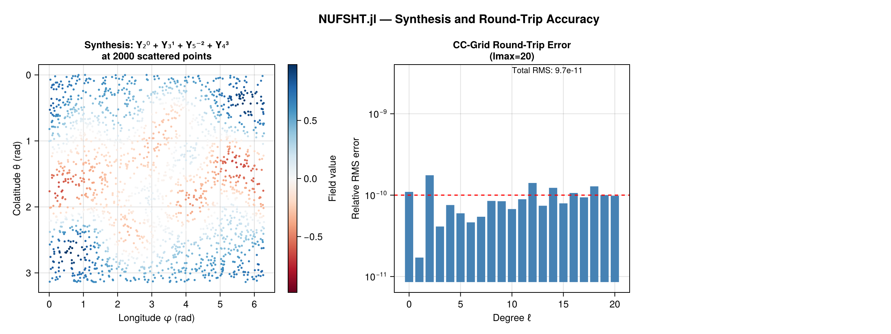
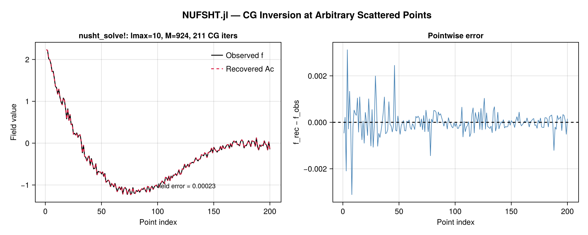
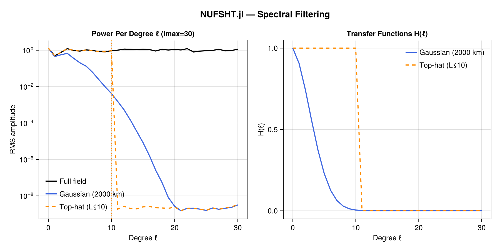
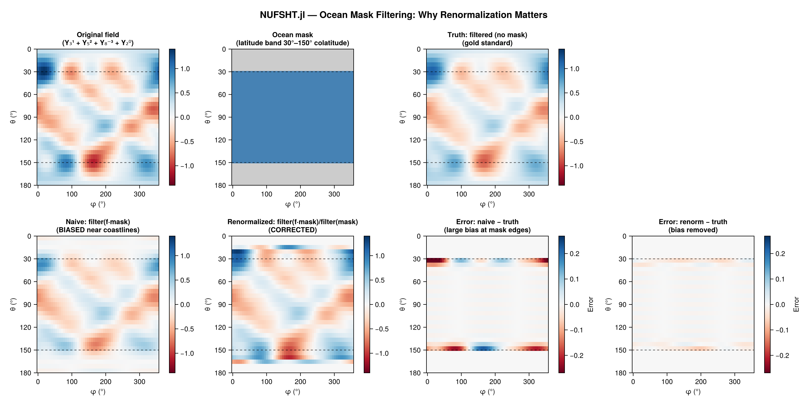

# NUFSHT.jl

**Non-Uniform Fast Spherical Harmonic Transforms** — native Julia implementation of the
Double Fourier Sphere (DFS) + NUFFT algorithm for spherical harmonic transforms at
arbitrary scattered (colatitude, longitude) points.

## Results

### Synthesis + Round-Trip Accuracy (10⁻¹¹ relative error)



### Inversion at Arbitrary Scattered Points



### Spectral Filtering



### Ocean Mask + Renormalization



## What it does

Given a field sampled at M arbitrary points on the sphere, NUFSHT.jl can:

- **Synthesise** (Type 2): Evaluate a bandlimited field (given as SH coefficients) at any scattered point set in O(K log K + M) time.
- **Adjoint** (Type 1): Apply `A†`, the transpose of the synthesis, to scattered values. It carries no quadrature weights, so it is not an analysis; `nusht_solve!` is.
- **Solve** (LSMR): Exactly invert the synthesis operator at any scattered point set.
- **Filter**: Apply isotropic spectral filters (Gaussian, top-hat, custom) entirely in harmonic space.

## Quick start

```julia
using Pkg
Pkg.add(url="https://github.com/jbphyswx/NUFSHT.jl")
```

```julia
using NUFSHT, FastSphericalHarmonics

lmax = 30
θ = rand(5000) .* π       # colatitudes ∈ (0,π)
φ = rand(5000) .* 2π      # longitudes ∈ [0,2π)
plan = make_plan(θ, φ, lmax; tol=1e-8)

# Synthesise at scattered points
C = zeros(lmax+1, 2lmax+1)
C[sph_mode(2, 0)] = 1.0
f = zeros(length(θ))
nusht_type2!(f, C, plan)

# Exact inversion at the scattered points
C_rec = allocate_coefficients(plan)
C_rec, iters, rel_res, converged = nusht_solve!(C_rec, f, plan; rtol=1e-6)
```

## Which function should I use?

| Scenario | Function |
|----------|----------|
| Evaluate SH expansion at scattered points | `nusht_type2!` |
| Apply the adjoint `A†` | `nusht_type1!` |
| Invert at arbitrary scattered points | `nusht_solve!` |
| Apply spectral filter at scattered points | `nusht_filter!` |
| Filter with land/ocean mask | `nusht_filter!` + `nusht_filter_renorm!` |

## Contents

```@contents
Pages = ["algorithm.md", "api.md"]
Depth = 2
```

## Module

```@docs
NUFSHT.NUFSHT
```
